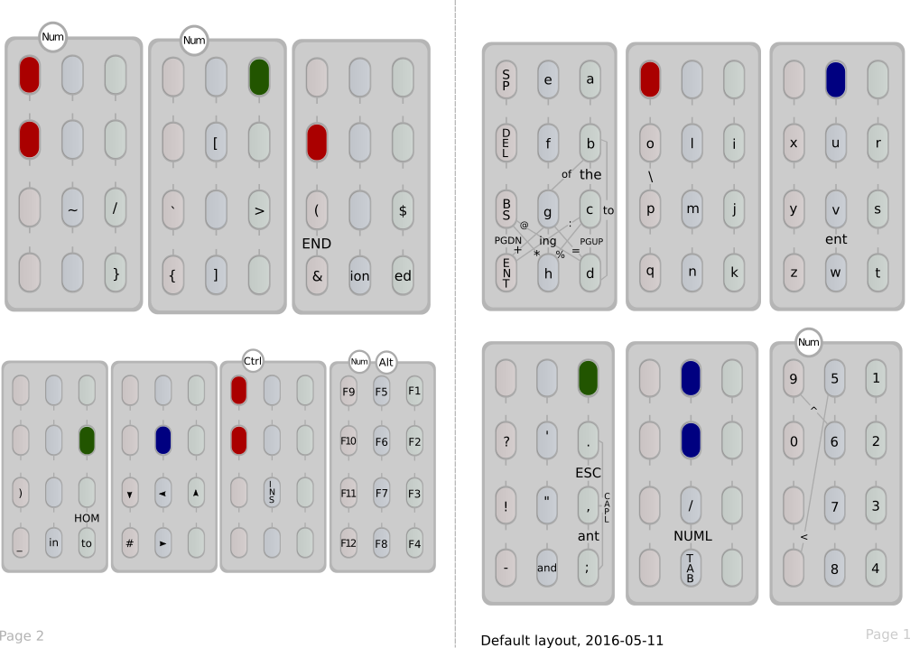
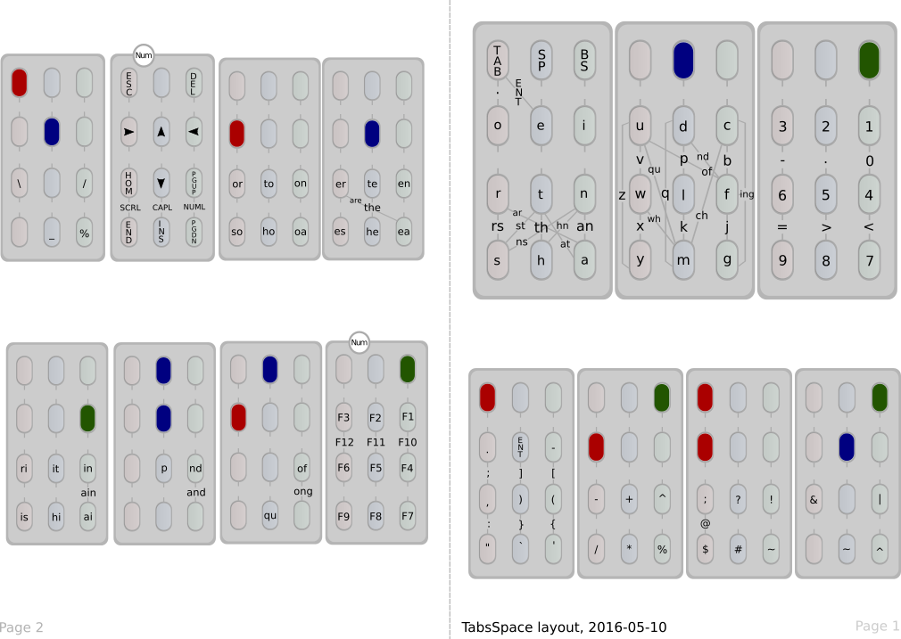
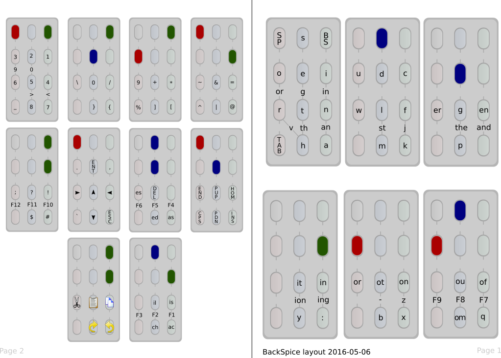
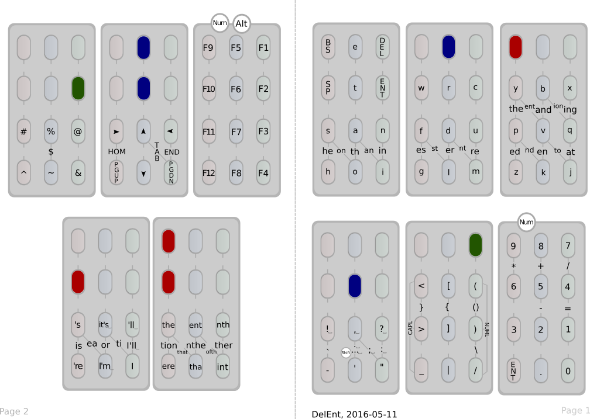

# twiddler-configs

This repo holds my [Twiddler3](http://twiddler.tekgear.com/) keyboard
config file as well as cheat sheets for the Twiddler3 layouts out
listed below. Hope they are useful to someone!

## Default

This is the default keyboard layout coming with the Twiddler since 20
years or so. Its letters are ordered alphabetically which makes it pretty
easy to learn.

## TabSpace

This was made by Brandon Rhodes in 1999 and changes the default layout
in many ways. He discusses the layout at length 
[in this PDF](http://rhodesmill.org/brandon/projects/tabspace-guide.pdf).

## BackSpice

Twiddler user Alex Bravo started from TabSpace and made his own
modifications until the two shared little resemblance. You can get 
the latest backspice config and read more information 
[at his github reposity](https://github.com/AlexBravo/Twiddler).

## DelEnt

This is my personal keyboard layout, named after the Del and Ent keys being next
to each other in it (had to pick something...). I made this by
starting from the Default config (so *not* from TabSpace) and changing
the letter to match how commonly they appear in English; the config
grew from there. 

While I'm both a Unix user and a programmer, my main use of the
Twiddler is for writing text when on the move (usually "blindly", with
the phone tucked away in a pocket).  So this layout does not have much
focus on programming/terminal use like some other layouts. I also have
rather short fingers which influenced where various common keys ended
up.  It's a work in progress.

## Cheat-sheet template

I've made an SVG template for presenting your own Twiddler config in a
nicer way. All the cheat sheets were created with it. It's meant to
become a little folder you can fold once or twice for easy reference.

The template was created in the free program
[Inkscape](https://inkscape.org/en/) and is released under BSD so use
as you like. The PDFs I made are ISO A4 format. If you prefer another
format, you can always change the document type of the corresponding
SVGs in Inkscape and print that.
